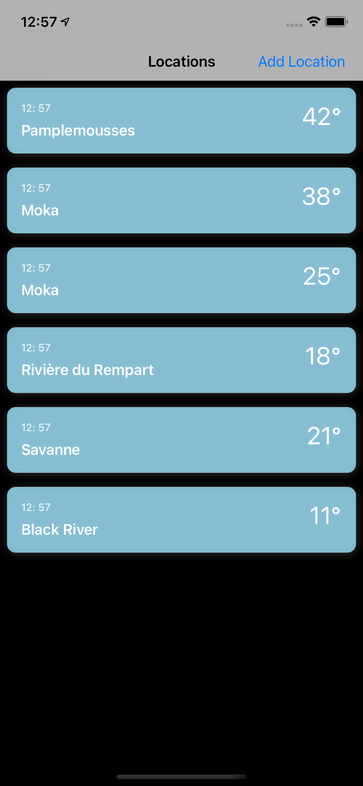

# Weather App
A project shows a list of location that is selected by user via pining on map and also User is able to see forecast according to day timings and weekly basis 

# Application Screenshots

# Requirement
- iOS 13.0+
- Xcode 12.2

# Installation
- To run the project :
- Open podfile from project repository 
- Open terminal and cd to the directory containing the Podfile
- Run the "pod install" command
- Open CS_iOS_Assignment.xcworkspace.

# Language 
Swift 5.0

# Version
1.0 

# Design Pattern Used
## MVVM
Model-View-ViewModel (MVVM) is a structural design pattern that separates objects into three distinct groups:

__View:__ Display visual elements and controls on the screen. In iOS View layer is represented by View and ViewController.

__ViewModel:__ Transform model information into values that can be displayed on a view. It interacts with the DataManager layer to retrieve the data. This layer will notify the changes in data to the View layer using completion handler.

__NetworkManger:__ This class interacts remotely. It retrieves the data from the server and map into the model.

__Model:__ hold application data. 

# Features
## Location List
This shows a list of location that is selected by user.

## Select Location 
User can select location by pining on location

## Hourly and Weekly forecast
User can see hourly and weekly forecast by tapping on location

# Assumptions        
-   The app is designed for iPhones only.        
-   App support english language.
-   Mobile platform supported: iOS (9.x)        
-   Device support - iPhone 6 Series, iPhone SE, iPhone 7 Series, iPhone 8 Series, iPhone X Series    
-   iPhone app support would be limited to portrait mode.

# Unit Testing
- Unit testing is done by using XCTest.

# (CocoaPods/Libraries) Used     
- SwiftLint (Formatting Code)
- SVProgressHUD (Showing Loader)

# Linting
## SwiftLint
- Integration of   [SwiftLint][https://github.com/realm/SwiftLint] into an Xcode scheme to keep a codebase consistent and maintainable .
- Install the swiftLint via cocoaPod and need to add a new "Run Script Phase" with:
"${PODS_ROOT}/SwiftLint/swiftlint"
- .swiftlint.yml file is used for basic set of rules . It is placed inside the project folder.

# Improvements
-  UI Testing could be implemented.
-  Real time data syncing and data caching could be implemented.

# References
[Bhavuk Chawla Github](https://github.com/ChawlaBhavuk)

[Bhavuk Chawla Blogs](https://mobikul.com/author/bhavuk-chawla546/)

# License
## MIT License

### Copyright (c) 2019 

Permission is hereby granted, free of charge, to any person obtaining a copy
of this software and associated documentation files (the "Software"), to deal
in the Software without restriction, including without limitation the rights
to use, copy, modify, merge, publish, distribute, sublicense, and/or sell
copies of the Software, and to permit persons to whom the Software is
furnished to do so, subject to the following conditions:

The above copyright notice and this permission notice shall be included in all
copies or substantial portions of the Software.

THE SOFTWARE IS PROVIDED "AS IS", WITHOUT WARRANTY OF ANY KIND, EXPRESS OR
IMPLIED, INCLUDING BUT NOT LIMITED TO THE WARRANTIES OF MERCHANTABILITY,
FITNESS FOR A PARTICULAR PURPOSE AND NONINFRINGEMENT. IN NO EVENT SHALL THE
AUTHORS OR COPYRIGHT HOLDERS BE LIABLE FOR ANY CLAIM, DAMAGES OR OTHER
LIABILITY, WHETHER IN AN ACTION OF CONTRACT, TORT OR OTHERWISE, ARISING FROM,
OUT OF OR IN CONNECTION WITH THE SOFTWARE OR THE USE OR OTHER DEALINGS IN THE
SOFTWARE.

